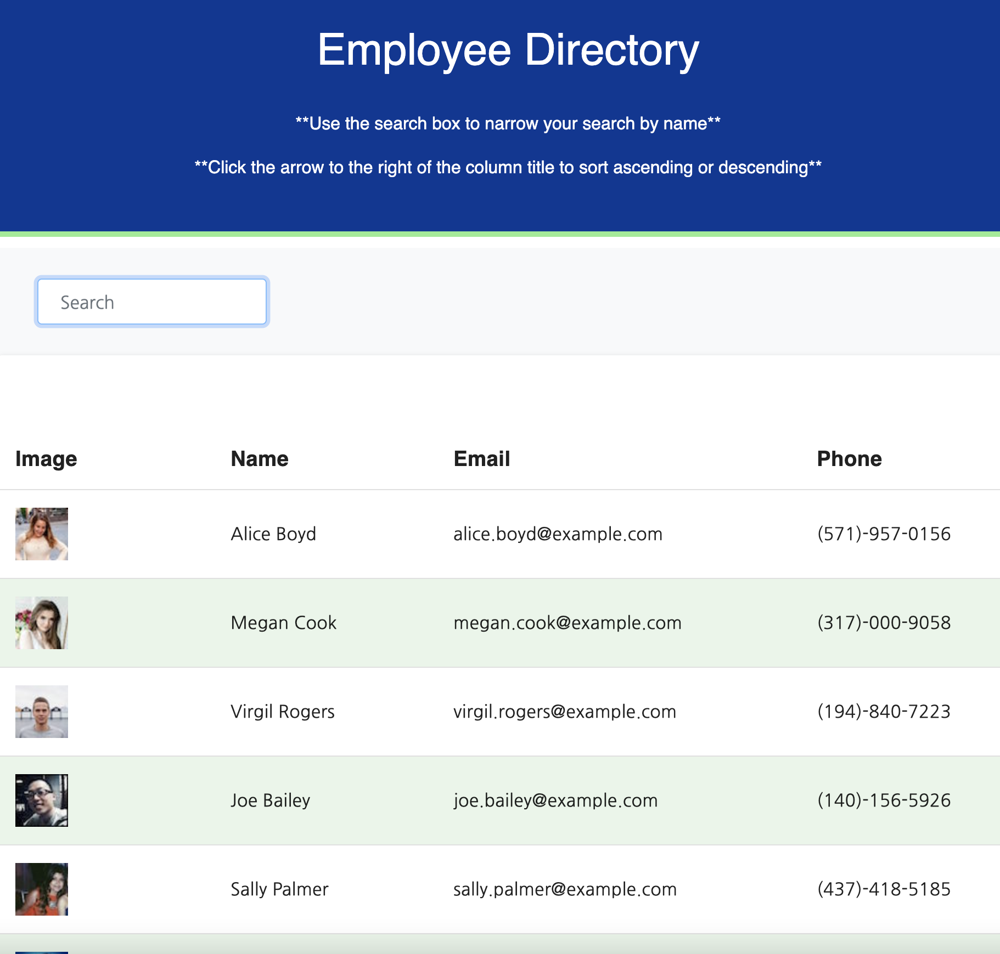

# 
**Employee Directory** 

## 
Table of Contents:

* [Description](#description)
* [Technologies](#technologies)
* [Usage](#usage)
* [Visuals](#visuals)
* [Testing](#testing)
* [Contributing](#contributing)
* [Questions](#questions)
* [License](#license)
 
 

## 
 <a name="description"> **Description** :</a>
 

An employee or manager would benefit greatly from being able to view non-sensitive data about other employees. It would be particularly helpful to be able to filter employees by name.  This app is created to help a person view an employee directory.   The user can search by name in the search bar, and it will dynamically create the list of the search every time a letter is entered.   All of the columns in the app can be sorted both ascending and descending.  

 
 

## 
 <a name="technologies"> **Technologies** :</a>
 

### Javascript
### HTML
### CSS
### React
### Express
### Bootstrap
### APIs

 
 

## 
<a name="usage"> **Usage** :</a>

The user will go to the home screen.   There the user is greeted by an employee directory, that has an image of the employee, the first and last name of thge employee, the email of the employee, and the phone number of the employee.  The user will be able to search through the employees list by typing in to the search button.   The user can also sort any of the categories in either ascending or descending order by clicking the arrow icon to the right of the column title.

 

## 
 **The Deployed site :**

### 

 
 

## 
<a name="visuals"> **Visuals** :</a>

This is the completed site:

Here is the site in action:

## 
<a name="testing"> **Testing** :</a>

N/A

## 
<a name="contributing"> **Contributing** :</a>

Pull requests are always welcome.  When contributing to this repository, please first discuss the change you wish to make via email or issue.  
After approval, please follow the "fork-and-pull" Git workflow.
<ol>
<li>Fork the repo on GitHub</li>
<li>Clone the project to your own machine</li>
<li>Commit changes to your own branch</li>
<li>Push your work back up to your fork</li>
<li>Submit a Pull request so that we can review your changes</li>
</ol>

## 
<a name="questions"> **Questions** :</a>

If you have any questions, feel free to reach out to me.   My email is ckhilpisch@gmail.com.

## 
 <a name="license"> **License** : 
 

MIT License
Informataion avaiable here: 
https://opensource.org/licenses/MIT

